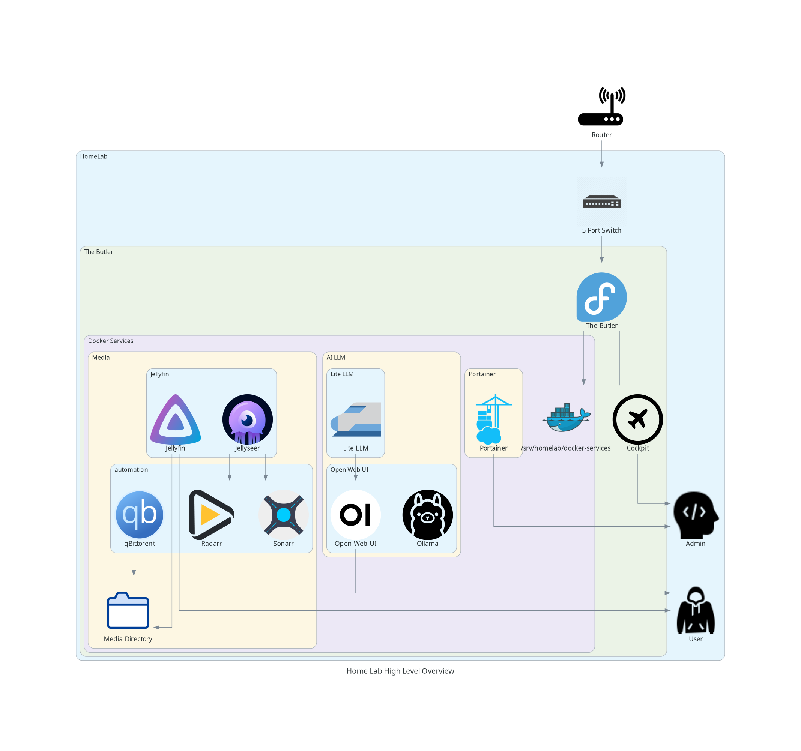

# Home Lab — Homelab Repo

## Short description
A mono-repo for managing my home lab. Including but not limited to docker services, OS administration and AWS experimentation. This is a personal project and is by no means supposed to represent the hight of my professionalism. Rather just a fun place to play around on the weekends.

## Status
- Repo: private (WIP)
- Currently in the planning stages

## Table of Contents
- [Goals](#goals)
- [Hardware and infrastructure](#hardware-and-infrastructure)
- [Architecture](#architecture)
- [Stack technology decisions and reasoning](#stack-technology-decisions-and-reasoning)
- [Repo layout](#Repo-layout)
- [Currently Running Services](#currently-running-services)
- [Future Services](#future-services)
- [Troubleshooting](#troubleshooting)
- [Contribution](#Contribution)

## Goals
- Easier system administation
- Single source of truth for docker-compose manifests and docs
- Reproducible environment, allowing for future hardware changes 
- Trackable configuration changes
- Hands on experiance and experimentation with new technologies

## Hardware and infrastructure
This entire system is running on my old laptop. It has modest specs:
- i7-7700HQ
- GTX-1050
- 8 GB RAM
- 120GB SSD
- 1TB internal HD
- 5TB external HD
I have plans to upgrade this machine, But for now. It does a great job and means i am contributing to the reduction in e-waste


## Architecture
 

## Stack technology decisions and reasoning
- Host: Fedora Server 
    - This was chosen to align closely with RHEL but without hamstringing my expermimentation efforts. I use RHEL extensively in a professional setting. However for the purposes of this project it is slightly too "locked down"
- Docker Engine/Docker Compose:
    - Used to align mostly with what i see used in the industry. 
- Cloudflare Tunnel
    - My IPS uses carrier grade NAT. This means that exposing these sevices behind a traditional reverse proxy is impossible. Therefore, Cloudflare tunnels provide a convenient and secure way to access these services outside of my home network. 

## Repo layout
```
homelab/
├── diagrams
│   └── custom-icons
└── docker-services
    ├── ai-llms
    │   ├── liteLLM
    │   └── open-web-ui
    ├── cloudflared-tunnel
    ├── media
    │   ├── jellyfin
    │   ├── jellyseer
    │   ├── qBittorrent
    │   ├── radarr
    │   └── sonarr
    ├── pi-hole
    └── portainer
```

## Currently Running Services
- Media:
    - Used to "own my media" and have my own private streaming service
- AI LLM's:
    - Allows me to experiment with running both local LLM's as well as utilize API keys to interact with comercial LLM's on a "per token" basis instead of being subscription based
- Pi-Hole:
    - Full network ad blocking. (DNS Sinkhole) 
- Portainer:
    - A convient way for me to see running containers and their health at a glance
- Fedora Cockpit:
    - Due to Carrier Grade Nat, This service (not run on docker) in conjunction with cloudflare tunnels gives me a convient web UI in which to administer the system from outside my home network

## Future Services
- Docker File Browser
    - Allows fast and easy file administation with a GUI
- Homepage
    - A central "command hub" for quick monitoring and access to varies services
- Home Assistant
    - Make myself a smart house! 


## Troubleshooting
- TBC

## Contact
- Owner: Ben Lewis
